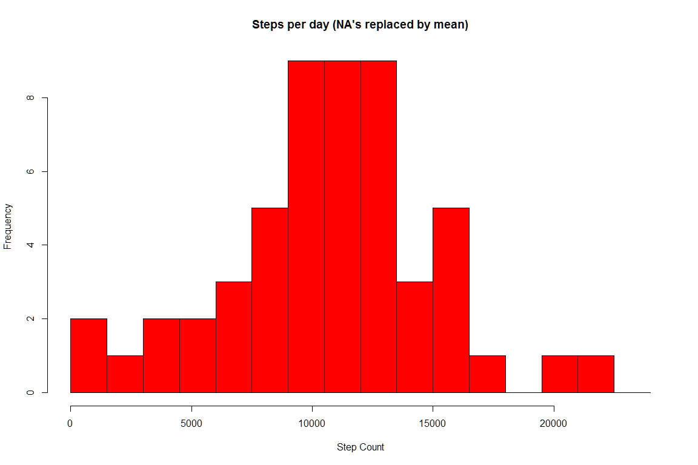

# Reproducible Research: Peer Assessment 1


### Loading and preprocessing the data


### What is mean total number of steps taken per day?

* Calculate the total number of steps taken per day


* Make a histogram of the total number of steps taken each day
<!-- -->

* Calculate and report the mean and median of the total number of steps taken per day

```r
meanSteps <- mean(dailySteps$steps)
medianSteps <- median(dailySteps$steps)
```

* Mean: 1.0766189\times 10^{4}
* Median:  10765


### What is the average daily activity pattern?

* Make a time series plot (i.e. type = "l") of the 5-minute interval (x-axis) and the average number of steps taken, averaged across all days (y-axis)

```r
# Calculate average steps for each of 5-minute interval during a 24-hour period
stepsInterval <- aggregate(steps ~ interval, activityData, mean)
plot(stepsInterval$interval,stepsInterval$steps, type="l", xlab="5 minute interval", ylab="Step count",main="Average Number of Steps by Interval")
```

<!-- -->

* Which 5-minute interval, on average across all the days in the dataset, contains the maximum number of steps?

```r
maxInterval <- stepsInterval[which.max(stepsInterval$steps),1]
```
The interval with the max number of steps across all days is 835


### Imputing missing values
* Calculate and report the total number of missing values in the dataset (i.e. the total number of rows with NAs)

```r
NAs <- sum(is.na(activityData$steps))
```
The total number of missing values is 2304

* Devise a strategy for filling in all of the missing values in the dataset. The strategy does not need to be sophisticated. For example, you could use the mean/median for that day, or the mean for that 5-minute interval, etc.

```r
# I will be simply finding the averages to fill in the missing values
# Need to first identify where the na's are.
na_idx <- which(is.na(activityData$steps))

# Now get the means where the indexes (not yet replacing)
meanOfTheIndexes <- rep(mean(activityData$steps, na.rm=TRUE), times=length(na_idx))
```

* Create a new dataset that is equal to the original dataset but with the missing data filled in.

```r
# For comparison sake showing the data prior to replacement of the NA's
head(activityData)
```

```
##         date weekday daytype interval steps
## 1 2012-10-01  monday weekday        0    NA
## 2 2012-10-01  monday weekday        5    NA
## 3 2012-10-01  monday weekday       10    NA
## 4 2012-10-01  monday weekday       15    NA
## 5 2012-10-01  monday weekday       20    NA
## 6 2012-10-01  monday weekday       25    NA
```


```r
# Now we replace the empty values of steps using the index as a locator and apply with the mean indexes
activityData[na_idx, "steps"] <- meanOfTheIndexes
```


```r
# Showing the activity data after replacement
head(activityData)
```

```
##         date weekday daytype interval   steps
## 1 2012-10-01  monday weekday        0 37.3826
## 2 2012-10-01  monday weekday        5 37.3826
## 3 2012-10-01  monday weekday       10 37.3826
## 4 2012-10-01  monday weekday       15 37.3826
## 5 2012-10-01  monday weekday       20 37.3826
## 6 2012-10-01  monday weekday       25 37.3826
```

* Make a histogram of the total number of steps taken each day and Calculate and report the mean and median total number of steps taken per day. 

```r
hist(dailySteps$steps, breaks=seq(from=0, to=25000, by=1500), main = paste("Steps per day (NA's replaced by mean)"), col="red", xlab="Step Count")
```

<!-- -->

What is the impact of imputing missing data on the estimates of the total daily number of steps?

```r
meanSteps <- mean(dailySteps$steps)
medianSteps <- median(dailySteps$steps)
```
* Mean: 1.0766189\times 10^{4}
* Median:  10765

* Do these values differ from the estimates from the first part of the assignment? 
** Really no difference since we used the mean.  It just averaged out.

### Are there differences in activity patterns between weekdays and weekends?

```r
library(lattice)

mean_data <- aggregate(activityData$steps, by=list(activityData$daytype, activityData$weekday, activityData$interval), mean)

# Rename the attributes
names(mean_data) <- c("daytype", "weekday", "interval", "mean")

xyplot(mean ~ interval | daytype, mean_data, 
       type="l", layout=c(1,2), lwd=1, 
       main = "Avg steps by interval", xlab="Interval", ylab="Number of steps")
```

<!-- -->

```r
# It appears that during the weekend the steps ramp up earlier in the day.
```
